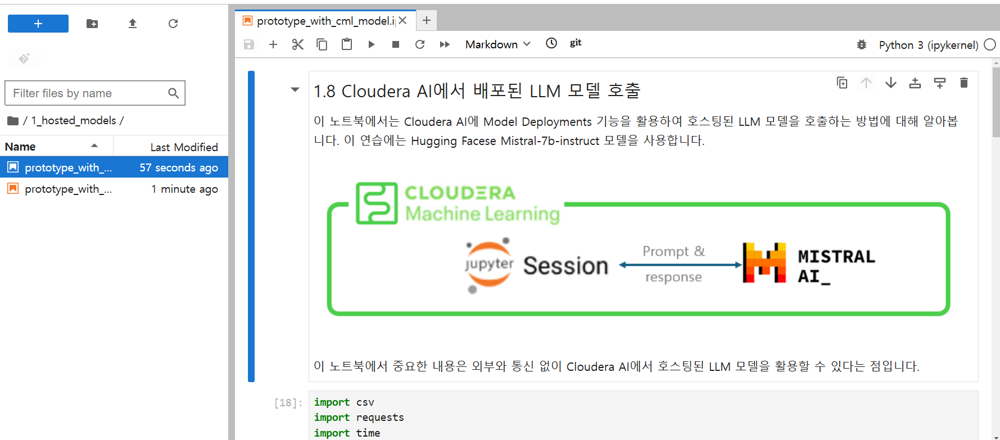
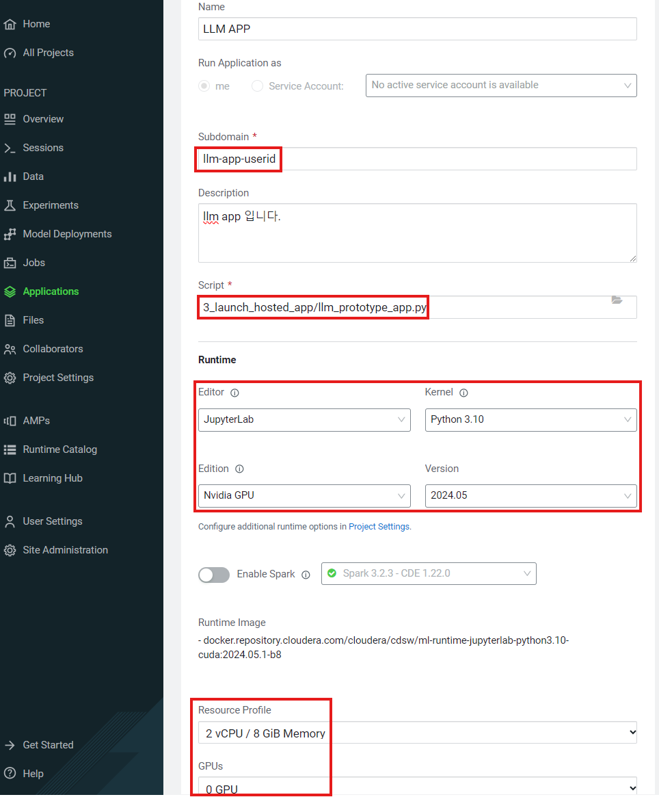

# Cloudera Machine Learning(CML)을 활용한 대규모 언어 모델

이 실습의 목표는 대규모 언어 모델을 위한 [검색 증강 생성](https://arxiv.org/abs/2312.10997) (RAG) 아키텍처의 관점에서 Cloudera Machine Learning(CML)을 탐구하는 것입니다.  
간단한 Jupyter 노트북에서 시작하여 완전한 챗봇 애플리케이션을 구축하면서, 참가자들은 CML의 주요 기능과 장점을 익히게 됩니다.  
실제 시나리오에서는 비즈니스 요구 사항의 변화와 기술 발전에 따라 민첩성이 필요하며, CML은 데이터 과학자들에게 이를 제공하는 훌륭한 도구입니다.  
LLM의 적용 범위는 산업 전반에 걸쳐 매우 넓지만, 이 실습의 목적을 위해 특정 사용 사례에 집중하는 것이 유용합니다.  

> **실습 사용 사례:**  
> 소프트웨어 벤더가 제품 문서를 검색할 때 직원의 생산성을 향상시키기 위해 LLM 기반의 채팅 인터페이스를 파일럿으로 도입하려고 합니다.  


## 실습 순서

궁극적으로 이 실습은 사용자가 새로운 접근 방식을 프로토타입하고 이를 LLM 애플리케이션과 같은 완전한 솔루션에 통합하는 과정의 용이성과 유연성을 보여주는 것을 목표로 합니다.  
현재 실습에는 8개의 연습이 있으며, 추후 다른 연습이 추가될 예정입니다.  
단계 간에 의존성이 있으므로 연습 순서를 따르는 것이 중요합니다.  

- [0. CML에 들어가기](#0-cml-시작하기)
- [1. CML을 통한 Amazon Bedrock 탐색](#1-cml을-통한-amazon-bedrock-탐색)
- [2. 데이터 스크래핑 및 Chroma DB에 데이터 Insert](#2-데이터-스크래핑-및-chroma-db에-데이터-insert)
- [3. CML 애플리케이션 배포](#3-cml-애플리케이션-배포)
- ~[ 4. Langchain](#4-langchain)~
- ~[5. 최종 애플리케이션 실행](#5-최종-애플리케이션-실행)~


## 0. CML 시작하기

SSO 로그인 링크를 사용하면 Cloudera Data Platform의 홈 화면으로 바로 이동하게 됩니다. 여기에서 CML(Data Services 중 하나)에 액세스할 수 있습니다.

> **0a.** "Machine Learning" 아이콘을 클릭하세요.

> **0b.** 그런 다음 _han-workshop-cml_ 라는 이름의 ML Workbench를 클릭합니다(랩의 설정에 따라 이름이 다를 수 있습니다).  


> 새로운 Cloudera UI로 전환한 경우, 화면은 아래와 같이 표시됩니다.  


CML이 처음이라면, 대시보드를 통해 사용할 수 있는 정보를 잠시 탐색해 보세요.  

워크스페이스를 구성하는 데는 _Project_ 라는 개념이 사용됩니다. 각 _Project_ 는 일반적으로 원격 저장소(e.g., Git)와 연결되어 있으며 여러 Collaborator 가 함께 작업할 수 있습니다. 시간을 절약하기 위해 _Hands on Lab Workshop with LLM_ 프로젝트가 미리 생성되어 있으며, 해당 프로젝트의 유일한 _소유자(Owner)_ 는 사용자입니다. 
( _LLM Model deploy for Hands on Lab_ 프로젝트가 보일 수 있지만, 지금은 신경쓰지 않으셔도 됩니다)

> **0c.** 준비가 되면 프로젝트를 클릭하세요:  


프로젝트 페이지를 익히는 데 잠시 시간을 가져보세요. 프로젝트에는 이제 필요한 모든 파일(코드베이스)이 있으며, 아래에 README 파일, 왼쪽 열에 프로젝트별 옵션 등이 포함되어 있습니다. 이 실습 과정에서 여기 나열된 많은 기능을 사용하게 됩니다.


## 1. CML을 통한 Amazon Bedrock 탐색

이 첫 번째 섹션에서는 Amazon의 Bedrock 서비스를 통해 모델(~Anthropic의 Claude~ Mistral)과 상호작용합니다. 이를 위해 Jupyter Notebook UI를 사용하여 _세션(Session)_ 을 시작합니다.  

> **1a.** 오른쪽 상단에서 _New Session_ 을 클릭하여 세션을 시작하세요. 또는 사이드바에서 _Sessions_ 를 클릭한 다음 _New Session_ 을 클릭해도 됩니다.  


> **1b.** 세션 이름을 입력하세요(예: "Jupyter Rocks!").  
> * **Editor**는 _JupyterLab_ 을 선택합니다.  
> * **Kernel**은 _Python 3.10_ 을 선택합니다.  
> * **Edition**은 _Nvidia GPU_ 를 선택합니다.  
> * 다른 설정은 변경하지 않습니다.  
> 

> **1c.** 오른쪽 하단에서 _Start Session_ 을 클릭하세요.

> **1d.** 몇 초 후, Python 3.10 커널과 추가 GPU 라이브러리를 실행하는 Jupyter UI가 포함된 세션이 생성됩니다.

> **1e.** 시작 코드 스니펫을 제안하는 팝업이 열립니다. _Don't show me this again_ 을 선택하고 팝업 창을 닫으세요.  

> **1f.** 이제 익숙한 Jupyter Notebook 인터페이스가 나타납니다. 왼쪽 탐색 패널에서 ```1_hosted_models``` 폴더로 이동한 후, ```prototype_with_aws_bedrock.ipynb``` 파일을 더블 클릭하여 여세요.  


> **1g.** 노트북의 설명을 읽으며 각 셀을 실행하세요(```Shift+Enter``` 또는 ```Command+Enter```를 사용할 수 있습니다). 


> **1h.** ```prototype_with_cml_model.ipynb``` 파일을 열어 CML 환경에서 배포된 LLM 모델을 호출해보세요. 노트북의 각 셀 실행 방법은 동일합니다.


:pencil2: CML은 모델을 호스팅하고 표준 API 메커니즘을 통해 노출하며, 기본 제공 인증 기능을 제공합니다. 내부적으로 모델을 호스팅하면 엔터프라이즈 IP를 보호할 수 있을 뿐만 아니라, 정밀한 파인튜닝 적용과 추론 비용의 장기적인 절감을 가능하게 합니다.
:pencil2: 이제 CML 세션 생성, JupyterLab 편집기 사용, 그리고 3rd party LLM 제공자와 상호작용하는 과정을 익혔습니다. 모든 작업은 격리되고 안전한 컴퓨팅 팟에서 이루어졌습니다.

## 2. 데이터 스크래핑 및 Chroma DB에 데이터 Insert

이 섹션에서는 [ChromaDB](https://www.trychroma.com/) 벡터 데이터베이스에 텍스트 데이터를 로드하기 위해 CML _Job_ 을 정의합니다. Job은 격리된 컴퓨팅 팟에서 스크립트를 실행하는 역할을 하며(연습 1에서의 _세션(Session)_ 과 유사), 스케줄에 따라 실행되거나, 수동으로 실행되거나, 선후행 관계로 연결하여 실행할 수 있습니다.

데이터 스크래핑과 관련하여  ```2_populate_vector_db/html_links.txt``` 파일에 HTML 링크가 이미 제공되어 있습니다. 이 샘플 링크는 [Cloudera의 CML 문서](https://docs.cloudera.com/machine-learning/cloud/)의 다양한 페이지를 가리킵니다. 실습에서 이 파일을 업데이트하여 다른 URL로 변경할 수 있지만, 링크를 업데이트할 때마다 Job을 다시 실행해야 합니다.

CML에서 _Job_ 을 생성하는 방법은 두 가지입니다: UI를 통해 생성하거나 [CML의 APIv2](https://docs.cloudera.com/machine-learning/cloud/api/topics/ml-api-v2.html)를 사용하여 프로그래밍 방식으로 생성하는 것입니다. 실제 환경에서는 두 번째 옵션을 사용하는 경우가 많지만, 우선은 UI를 통해 Job을 생성하여 과정을 더 잘 이해하는 데 집중합니다.

> **2a.** 프로젝트에 이미 _Pull and Convert HTMLS to TXT_ 라는 Job이 생성되어 있습니다. 이 Job은 새로 생성할 Job의 의존성(dependency)이 됩니다. 아직 실행하지는 마세요.  


> **2b.** 왼쪽 사이드바에서 _Jobs_ 를 클릭하세요.  


> **2c.** 오른쪽 상단의 _New Job_ 버튼을 클릭하세요.  


> **2d.** 다음 화면에서 Job 이름을 입력하세요.

> **2e.** **Script** 아래에서 폴더 아이콘을 클릭하여 ```2_populate_vector_db/populate_chroma_vectors.py```를 선택하세요.

> **2f.** 아래 설정에 따라 올바른 런타임 설정을 선택했는지 확인하세요:  
> - **Editor**: _JupyterLab_  
> - **Kernel**: _Python 3.10_  
> - **Edition**: _Nvidia GPU_  

> **2g.** **Schedule**에서 _Dependent_ 를 선택한 다음, Job으로 _Pull and Convert HTMLS to TXT_ 를 선택하세요.  


> **2h.** 화면 맨 아래로 스크롤하여 _Create Job_ 을 클릭하세요.

좋습니다! 이제 직접 CML Job을 생성했습니다! 스크래핑 Job을 실행하면 벡터 DB를 채우는 Job이 자동으로 시작됩니다.

> **2i.** _Jobs_ 로 다시 이동하세요(위 **2b** 단계 참조).

> **2j.** _Pull and Convert HTMLS to TXT_ Job 옆의 _Run as_ 버튼을 클릭하세요. Job은 [machine user](https://docs.cloudera.com/management-console/cloud/user-management/topics/mc-machine-user.html)(서비스 계정)로도 트리거할 수 있습니다.  


약 1분 후 두 개의 Job이 모두 성공적으로 완료되었음을 확인할 수 있습니다. Job이 실행되는 동안 ```2_populate_vector_db/pinecone_vectordb_insert.py``` 파일의 코드를 검토하려면 새 탭에서 _Overview_ > _Files_ 로 이동하세요.  


:pencil2: CML Job은 반복 작업을 자동화하고 머신러닝 프로젝트의 워크플로를 간소화할 수 있는 기능을 제공합니다. 격리된 컴퓨팅 프레임워크 내에서 인기 있는 Open source 벡터 데이터베이스와 상호작용하는 방법을 학습했습니다.

> **2k.** ```create_chroma_job.ipynb``` 노트북을 엽니다.  노트북의 모든 셀을 실행해 보세요.


> **2l.** Job이 성공적으로 완료되었는지 확인하려면,  버튼을 눌러 세션에서 나옵니다. 그런 다음 왼쪽 사이드바의 _Jobs_ 로 이동하면 _Populate Chroma Vector DB job_ 옆에 _Success_ 상태가 표시됩니다.

> **2m.** Job이 성공적으로 완료되었는지 확인하려면,  버튼을 눌러 세션에서 나옵니다. 그런 다음 왼쪽 사이드바의 _Jobs_ 로 이동하면 _Populate Chroma Vector DB job_ 옆에 _Success_ 상태가 표시됩니다.

> **2n.** ```chroma_vectordb_usage.ipynb``` 파일을 열어 Chroma vector DB 사용 방법을 확인하고 실행해 보세요.

----
## 3. CML 애플리케이션 배포

지금까지 Jupyter 노트북을 통해 모델과 벡터 데이터베이스를 다뤘습니다. 이제 CML 애플리케이션을 통해 사용자가 LLM 솔루션과 상호작용하는 방법을 알아보겠습니다.  
CML은 [flask](https://flask.palletsprojects.com/en/3.0.x/), [streamlit](https://streamlit.io/), [gradio](https://www.gradio.app/)와 같은 인기 프레임워크를 기반으로 UI 애플리케이션을 배포하는 데 사용됩니다.  
이 실습에서는 gradio 앱을 배포하여 채팅 인터페이스를 통해 모델과 상호작용할 것입니다.

이 연습은 UI를 사용하여 애플리케이션을 배포하는 단계를 안내합니다. 또한 CML APIv2를 통해 프로그래밍 방식으로 이를 수행하는 방법도 탐색합니다.

> **3a.** 세션 상단의  버튼을 클릭하여 프로젝트 화면으로 돌아가세요.

> **3b.** 왼쪽 사이드바에서 _Applications_를 클릭하세요.  


> **3c.** 화면 중앙의 _New Application_ 버튼을 클릭하세요.

> **3d.** 애플리케이션 이름을 입력하세요. 여기서는 ```LLM APP```으로 설정합니다.

> **3e.** 고유한 서브도메인 이름을 입력하세요. 이는 반드시 고유해야 합니다.

> **3f.** 애플리케이션 **Script**의 경로로 다음을 선택하세요:  
```3_launch_hosted_app/llm_prototype_app.py```

> **3g.** 아래 설정에 따라 애플리케이션의 올바른 컨테이너 설정을 선택했는지 확인하세요:  
> * **Editor:** _Jupyter Notebook_  
> * **Kernel:** _Python 3.10_  
> * **Edition:** _Nvidia GPU_

> **3h.** 리소스 프로필로 _2 vCPU / 8 GB Memory_를 선택하세요.  


> **3i.** 페이지 하단의 _Create Application_ 을 클릭하세요.

### 애플리케이션과 상호작용하기
애플리케이션이 시작되기까지 몇 분이 걸릴 수 있습니다. 시작 후 카드에서 애플리케이션을 클릭하면 UI를 열 수 있습니다. 시작되는 동안 ```3_launch_hosted_app/llm_prototype_app.py```의 코드를 검토해 보세요.

스크립트가 일부 환경 변수를 사용하는 것을 확인할 수 있습니다. 이러한 변수는 ML Workspace 수준에서 설정되어 모든 프로젝트에서 공유될 수 있습니다. 또는 환경 변수는 특정 프로젝트, 세션, Job, 또는 애플리케이션에 국한될 수도 있습니다.

또한 이 스크립트가 이전에 벡터 데이터베이스를 쿼리하는 데 사용한 코드와 몇 가지 기능을 공유하는 것을 알 수 있습니다. 새로운 응답 함수는 사용자가 선택한 모델에 따라 응답을 완성하는 것도 고려합니다. 이는 CML의 모듈화 기능의 강력함을 보여줍니다.

> **3j.** 애플리케이션이 성공적으로 배포되었는지 확인하세요. 메시지를 통해 확인할 수 있습니다.  


> **3k.** 애플리케이션의 URL을 클릭하여 gradio UI로 이동하세요. 새 탭에서 애플리케이션이 열리는 것을 확인할 수 있습니다.  


CML에 대해 다양한 질문을 해보세요. 시작하는 데 도움이 되는 몇 가지 예는 다음과 같습니다:  
- What is ML Runtime?  
- What version of datalake is compatible with CML 2.0.45?  
- What is the latest CML release?  

_Bonus question_ 마지막 질문(CML 릴리스에 대한 질문)에서 모델이 예상한 결과를 반환하지 않은 이유는 무엇일까요? 이를 해결할 수 있는 방법에는 어떤 것들이 있을까요?

또한 애플리케이션 응답 방식을 변경하기 위해 하단의 매개변수를 조정할 수 있습니다. ChromaDB 사용 여부(즉, 검색 증강 비활성화), 응답 길이 조정, _Temperature_ (창의성/무작위성) 조정이 가능합니다. 벡터 데이터베이스를 사용하는 응답은 더 많은 토큰을 입력 컨텍스트로 처리해야 하므로 시간이 더 걸릴 수 있습니다.

:pencil2: CML의 주요 기능 중 하나는 데이터 과학 워크플로의 일부로 통합된 애플리케이션을 호스팅하는 것입니다. 실무자는 신속하게 반복하며 이해관계자에게 통찰력, 기능, 프로토타입을 안전하게 공유할 수 있습니다.

```
## (수정 전) 4. Langchain

지금까지 우리는 LLM, 벡터 데이터베이스, 애플리케이션, 코드베이스, 그리고 기본 플랫폼과 상호작용할 수 있도록 구성된 여러 구성 요소를 살펴보았습니다.  
Langchain은 이러한 구성 요소(및 추가 구성 요소)를 유연하게 연결할 수 있는 강력한 라이브러리입니다.  
이번 실습에서는 Langchain의 특정 사용 사례를 살펴봅니다. 더 많은 정보를 보려면 [Intro to Langchain](https://python.langchain.com/docs/get_started/introduction)을 참조하세요.

이 섹션에서는 Langchain을 사용하여 다음 구성 요소를 "체인"으로 연결합니다:
- Amazon Bedrock 모델
- 로컬에 호스팅된 Chroma 벡터 데이터베이스
- 프롬프트 템플릿

Langchain을 사용하는 장점은, 체인 객체를 한 번 생성하면 벡터 저장소를 쿼리한 다음, LLM으로 경로를 보내 응답을 받는 작업을 사용자 정의 함수에 의존하지 않고 단일 함수에서 처리할 수 있다는 점입니다.  
체인의 구성 요소는 필요에 따라 쉽게 교체할 수 있습니다.

> **4a.** 세션으로 이동하세요. 세션이 만료된 경우 새 세션을 생성하세요.

> **4b.** ```6_langchain_introduction``` 경로로 이동한 뒤, ```Langchain_Bedrock_Chroma.ipynb```라는 제목의 노트북을 엽니다.  


> **4c.** 노트북의 셀을 실행하며 작업을 진행하세요. 완료한 후 Jupyter 세션을 종료하고 이 가이드로 돌아오세요.

:pencil2: 이번 실습에서는 인기 있는 체이닝 패키지를 익히고, Bedrock, Chroma, 특정 프롬프트 템플릿과 상호작용하기 위한 체인을 구축하는 CML 세션에 이를 적용했습니다.

## (수정 전) 5. 최종 애플리케이션 실행

이제 모든 구성 요소를 통합하여 내부/외부 모델 선택 및 벡터 DB 선택(내부 또는 외부)을 허용하는 최종 애플리케이션을 실행합니다.  
이는 CML로 구축된 LLM 애플리케이션의 유연성을 보여줍니다.

먼저 3단계에서 생성한 애플리케이션으로 돌아갑니다.

> **5a.** 메인 프로젝트 화면으로 이동하여 왼쪽 사이드바에서 _Applications_를 클릭하세요.  
4단계에서 생성한 애플리케이션을 볼 수 있습니다.  


> **5b.** 오른쪽 상단의 점 세 개를 클릭한 후 _Application Details_를 선택하세요.  


> **5c.** 상단의 _Settings_ 섹션을 선택하세요. 이제 애플리케이션의 새로운 파일을 선택합니다.  
**Script** 섹션 아래의 폴더 아이콘을 클릭한 후 파일 경로 ```8_launch_app_final/llm_app_final.py```를 선택하세요.  


> **5d.** 페이지 하단에서 _Update Application_을 클릭하세요.  


> **5e.** 애플리케이션이 _Running_ 상태가 되면, 애플리케이션을 클릭하여 UI를 엽니다.

> **5f.** 애플리케이션 UI에서 _Additional Inputs_ 섹션을 확장하세요.  


> **5g.** 여기에서 사용할 수 있는 모든 애플리케이션 매개변수를 확인할 수 있습니다.  
모델, 벡터 DB 및 각 프롬프트에 사용할 기타 매개변수를 선택하세요. 마지막으로 질문을 시작할 준비가 완료되었습니다!  

```
## :tada: 축하합니다! :tada:
지난 몇 시간 동안 많은 것을 배웠습니다. 하지만 이는 시작에 불과합니다.  
[Cloudera Machine Learning](https://www.cloudera.com/products/machine-learning.html)은 온프레미스 및 클라우드에서 [Cloudera Data Platform](https://www.cloudera.com/)의 일부로 귀하의 엔터프라이즈에 더 많은 것을 제공합니다.
